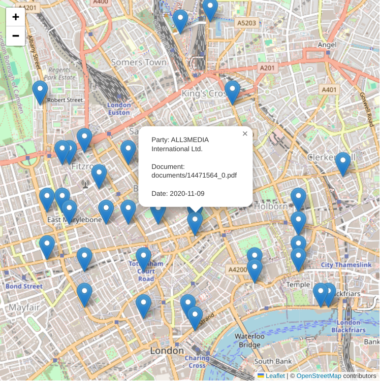

# A Multidisciplinary Research Corpus Compiler Based on Real-World Business Documents for Economic, Linguistic, Legal, and Social Sciences

A research corpus compiler of 15,000 open real-world business documents

The corpus is ready-to-use for standard analytical and machine learning tools

This project is an output of a research article *(link to be added upon publication)*

Sample geographic distribution of business documents from entities in a London district



## Source code

Jupyter notebook source code for corpus compilation [corpus-compiler-business-documents](corpus-compiler-business-documents.ipynb)

## Note

Nominatim geocoding is rate-limited to 1 request per second

Processing time is substantial (hours) due to the dataset size

The software caches results (e.g., geolocation) to accelerate subsequent corpus updates

For faster processing, consider running a local Nominatim instance at http://localhost:8080

Set `try_nominatim_local=True`

```python
geocode_addr(addr,raise_error_data=False,raise_error_request=False,try_nominatim_local=True)
```
